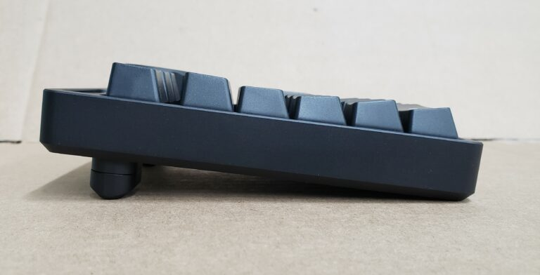

# RM Numpad Build Guide

**First, take an inventory to make sure you have all of the required parts:**

- PCB
-  Plate
-  Case
-  Knob
-  2 aluminum 4 degree feet
-  2 aluminum 7 degree spacers (optional)
-  4 button head mounting screws
-  2 flat head feet screws
-  1 knob set screw
-  2x allen wrenches
-  1 encoder
-  1 USB-C plug
-  4 rubber feet
-  4 plastic washers (optional, only for PCB v1.2)

**Next, Solder the USB plug onto the PCB**

Insert the USB plug onto the bottom of the PCB (It needs to be on the same side as the rest of the pre-soldered components.)

Start by soldering the 4 posts on either side of the plug from the TOP of the PCB (the BOTTOM of the PCB has the MCU and diodes soldered onto it).  Make sure the plug is aligned straight. If it’s slightly crooked, it will be much easier to fix now vs after all of the pins are soldered. Once you’re satisfied with the position of the USB plug, use the drag method, along with plenty of flux, to solder the pins.

Tips for success:
1. Use lots of flux. Too much flux just makes a mess, but it’s easy to clean up with rubbing alcohol later. Better to have too much flux than not enough.

2. Use very little solder. It’s easier to add more solder than to remove solder.

3. Don’t apply solder directly to the joints, just use the soldering iron tip to transfer solder onto the joints. Clean your tip, place a small amount of solder onto it, and drag across the contacts.

4. Watch the temperature! Don’t get things too hot. There is very little solder involved, which takes very little time to heat up. Take your time, be patient, and don’t be afraid to step away and let it cool down.

It should look like this when you’re done. You shouldn’t have to do any soldering to the USB plug on the bottom of the PCB.

Use a continuity tester or a multi-meter to verify you haven’t bridged pins accidentally.

This confusing screenshot shows which pins should be connected:

Below is a screenshot of the same USB plug footprint, with just the pins labeled. For each pin, use a continuity tester to confirm the following:

**S1:** The four large posts we soldered first are labeled S1, and they all go to ground. They should have continuity between each other.

**Ground:**

The following pins go to ground. They should have continuity between each other, and to the S1 pins, but nowhere else:

B12, A1, B1, A12

**Power**

The following pins are power pins. They should have continuity between each other, and nowhere else:

B9, A4, B4, A9

**D+**

The following are D+ pins. They should have continuity between each other, and nowhere else:

B6, A6

**D-**

The following are D- pins. They should have continuity between each other, and nowhere else:

B7, A7

**Standalone pins**

The rest of the pins should not have continuity to any other pins:

B8, A5, B5, A8Standalone pins

Flash QMK firmware onto the board.

Using the instructions provided by QMK, flash your desired layout onto the PCB. Using a jumper wire, confirm that all of the keys work as expected.  Do not proceed until this is done.

Here are 3 layout options, if none of these fit your needs, you can create your own using the QMK Repo.

[firmware](firmware/)

Solder the encoder onto the PCB

Inspect the encoder to make sure none of the legs are bent or damaged. Insert the encoder into the top of the PCB, and solder the 4 legs first.  Make sure the encoder is positioned correctly, as it will be more difficult to move once the pins are soldered. Once you’re satisfied with the position of the encoder, solder the remaining pins.

**Glue washers in place**

This step is only required if your PCB has “V1.2” printed on the back.

On V1.2 of the PCB, the mounting holes were incorrectly drilled over sized. I’ve included washers to prevent the mounting screw heads from pulling through the over sized holes. Once the plate is installed, it will be very difficult to place these washers, so its best to do it now.

Drop the PCB into the case. The tolerance used by the PCB manufacturer when cutting out the PCBs is relatively large, so the fit in the case may be tight. The case is designed to hold the PCB in place without any movement. Even so, if the PCB is on the larger side of tolerance, a little sanding of the edges may be needed for it to fit if you prefer not to force it into the case.

Place the 4 washers above the mounting holes and use a very small drop of superglue to hold them in place. Use the mounting screws to keep them in position while the glue dries. Be careful not to glue the screws onto the washers or the case.

**Install Stabilizers**

Install the stabilizers where needed. Positions of the stabilizers will depend on your selected layout. Installation method will depend on your choice of stabilizer.

**Install plate & switches**

Install the plate and switches where needed.  Make sure all of the switches are firmly seated in the plate, and PCB before soldering.

Once you’re satisfied with the position of all of the switches, solder them into place.

Install feet onto case

Place the adhesive-backed rubber feet into the necessary locations: either directly onto the case, or onto the 4 degree feet.

If desired, using the 2x M3 flat head screws, install the 4 degree feet, or 7 degree spacers and 4 degree feet.
Use a small drop of light oil on the screw threads when you install them.

**Install PCB into case**

Drop the PCB assembly into the case, and ensure the mounting holes are aligned properly.  The tolerance used by the PCB manufacturer when cutting out the PCBs is relatively large, so the fit in the case may be tight. The case is designed to hold the PCB in place without any movement. Even so, if the PCB is on the larger side of tolerance, a little sanding of the edges may be needed for it to fit if you prefer not to force it into the case.

Use the 4x M2 button head screws to mount the PCB assembly into the case.  Use a very small drop of light oil on the screw threads when you install them.  Be careful not to over tighten.

**Install knob onto encoder**

Apply a small drop of light oil onto the M2.5 set screw, and thread into the knob until you can see it slightly protruding into the hole on the bottom of the knob.

Align the screw with the flat on the encoder, and drop the knob onto the encoder.  Tighten the set screw to hold it in place. Be careful not to over tighten, very little pressure is needed to hold the knob in place.

**Install keycaps**

You know what to do.

